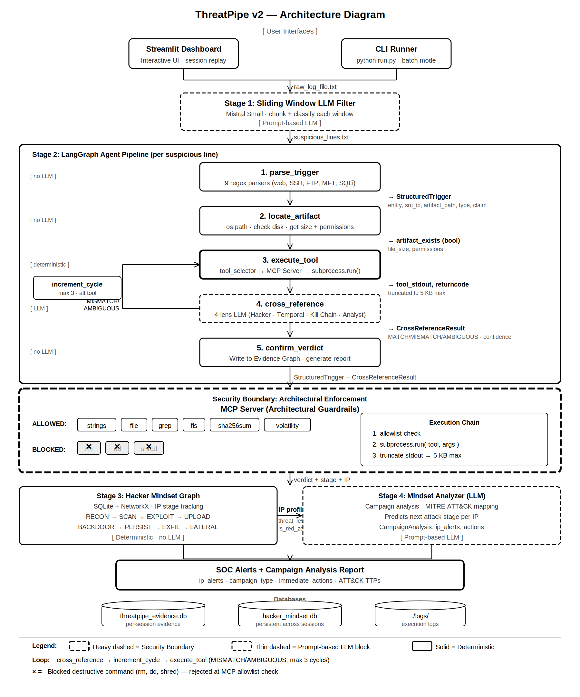

# 🛡️ ThreatPipe v2: Autonomous SIFT IR Agent with MCP

> **FIND EVIL! Hackathon Submission** | Pattern: Multi-Agent Framework (LangGraph) + Custom MCP Server

AI-powered adversaries can go from initial access to full domain control in under 8 minutes. Meanwhile, human incident responders are still looking up command-line flags. **ThreatPipe v2 closes that gap.**

ThreatPipe v2 is an autonomous, SIFT-native incident response agent that doesn't just suggest commands—it executes the forensic workflow safely, at machine speed, without hallucinating or destroying evidence. It operates in four stages:
1. **LLM Log Triage:** Instantly identifies suspicious logs from noisy datasets using a sliding window LLM.
2. **Autonomous SIFT Investigation:** Parses logs, locates artifacts on disk, and executes real forensic tools (`strings`, `file`, `grep`, `fls`) via a custom MCP server.
3. **4-Lens Cross-Referencing & Self-Correction:** Forces the LLM to analyze evidence from Hacker, Temporal, Kill Chain, and Analyst perspectives. If confidence is low, it autonomously retries with an alternate tool.
4. **Persistent Attacker Tracking:** Maps attacker behavior to a persistent "Hacker Mindset Graph," calculating risk scores and predicting their next MITRE ATT&CK move.

---

## 📐 Architecture Diagram



---

## ✨ Key Features

- 🧠 **LLM-Guided Triage:** Uses Mistral to instantly identify suspicious logs from noisy datasets.
- 🔬 **Real SIFT Tool Execution:** Runs actual forensic tools (`strings`, `file`, `grep`, `fls`) via subprocess.
- 🛑 **MCP Architectural Guardrails:** Agent physically cannot run destructive commands (`rm`, `dd`) due to a strict MCP tool allowlist.
- 🔄 **Self-Correcting Loop:** If confidence is low, the agent autonomously retries with an alternate SIFT tool (up to 3 cycles).
- 👁️ **4-Lens Cross-Referencing:** Forces the LLM to analyze evidence from Hacker, Temporal, Kill Chain, and Analyst perspectives before giving a verdict.
- 🕸️ **Persistent Hacker Mindset Graph:** Tracks attacker IPs across sessions, calculates risk scores, and predicts their next MITRE ATT&CK move.
- 📊 **Interactive SOC Dashboard:** Streamlit UI to upload logs, view verdicts, and explore attack graphs.

---

## 🐧 System Requirements

**✅ Recommended OS: Debian / Ubuntu (Native SIFT Environment)**
This project is designed to run on the SANS SIFT Workstation, which is built on Ubuntu (Debian-based). It will run smoothly on any Debian/Ubuntu system where SIFT forensic tools are available in the `PATH`.

> ⚠️ **Note for Windows/macOS Users:** The core pipeline will run, but SIFT tools like `fls`, `mmls`, and `mactime` may not be available natively. For the full experience, use a Debian/Ubuntu VM or WSL2.

### Prerequisites
- Python 3.10+
- Mistral API Key ([Get one here](https://console.mistral.ai/))
- Git

---

## 🚀 Quick Start (5 Minutes)

### 1. Clone the Repository
```bash
git clone https://github.com/Prathameshsci369/ThreatPipe-v2-Autonomous-SIFT-IR-Agent-with-MCP.git
cd ThreatPipe-v2-Autonomous-SIFT-IR-Agent-with-MCP/ThreatPipe-v2/
```

### 2. Run the One-Click Setup
This script will create a virtual environment, install Python dependencies, create forensic test files on disk, and generate test attack logs.

```bash
chmod +x setup.sh
./setup.sh
```

### 3. Set your API Key
```bash
export MISTRAL_API_KEY='your-mistral-api-key-here'
```

### 4. Launch the Dashboard 📊
```bash
source venv/bin/activate
streamlit run dashboard.py
```
Open your browser to `http://localhost:8501`, upload the generated `realistic_attack.log`, and click **🚀 Run Analysis**!

---

## 🛠️ Manual Setup (If `setup.sh` fails)

If the one-click script fails, follow these steps manually:

```bash
# 1. Create and activate virtual environment
python3 -m venv venv
source venv/bin/activate

# 2. Install dependencies
pip install --upgrade pip
pip install -r requirements.txt

# 3. Create the forensic test files on disk (The Crime Scene)
python3 setup_test_evidence.py

# 4. Generate the attack log files (The Camera Footage)
python3 generate_test_logs.py --size medium

# 5. Set your API key
export MISTRAL_API_KEY='your-mistral-api-key-here'

# 6. Run the agent!
streamlit run dashboard.py
```

---

## 💻 CLI & MCP Server Usage

### Run the CLI Pipeline
To run the full pipeline directly in your terminal:
```bash
source venv/bin/activate
export MISTRAL_API_KEY='your-mistral-api-key-here'
python stream_run.py realistic_attack.log
```

### Run the MCP Server 🌐
To expose ThreatPipe as a REST API for external tools (like Claude Desktop or curl):
```bash
source venv/bin/activate
uvicorn mcp_server:app --host 0.0.0.0 --port 9000 --reload
```

**Test the MCP Server:**
```bash
curl -X POST http://localhost:9000/investigate \
  -H "Content-Type: application/json" \
  -d '{"log_line": "192.168.1.55 - - [16/Apr/2026:03:14:25] \"GET /uploads/shell.php?cmd=whoami HTTP/1.1\" 200"}'
```

### 🧪 Generating Different Test Data
ThreatPipe includes a powerful log generator to test the LLM sliding window with different data volumes:
```bash
# Small dataset (Fast test, ~30 lines)
python generate_test_logs.py --size small

# Large dataset (Tests LLM context chunking, ~3000 lines)
python generate_test_logs.py --size large

# Targeted test (Only Web Shells and SQLi attacks)
python generate_test_logs.py --attacks webshell,sqli --output sqli_test.log
```

---

## 🔒 Security & MCP Guardrails

In incident response, evidence integrity is paramount. ThreatPipe enforces safety through **architectural guardrails**, not just prompt-based instructions.

### How the MCP Tool Layer Protects Evidence
Instead of giving the LLM an open shell (`execute_shell_cmd`), `agent.py` routes all tool requests through `mcp_tools.py`:

1. **🛑 Tool Allowlist:** The agent can only call read-only forensic tools (`strings`, `file`, `grep`, `fls`, `sha256sum`, `volatility`). Destructive commands (`rm`, `dd`, `shred`, `mkfs`) are physically impossible to execute because they are not in the `ALLOWED_SIFT_TOOLS` dictionary.
2. **✂️ Output Truncation:** SIFT tools can dump megabytes of text, crashing the LLM's context window. The MCP layer truncates output to 5KB before returning it to the agent.
3. **🛡️ Path Validation:** Prevents path traversal attacks by validating artifact paths before execution.

> *If the LLM hallucinates a destructive command, the MCP server blocks it. If the model ignores read-only rules, the architecture enforces them.*

---

## 📊 Accuracy & Dataset Reports

We take IR accuracy and evidence integrity seriously. ThreatPipe is designed to have **zero false positives** (it will not hallucinate attacks without tool evidence) while actively self-correcting to minimize false negatives.

- 📄 **[Accuracy Report](ThreatPipe-v2/accuracy_report.md):** Detailed self-assessment of findings accuracy, hallucination checks, evidence integrity testing, and iterative bug fixes.
- 📄 **[Dataset Documentation](ThreatPipe-v2/dataset_documentation.md):** Ground truth documentation for the generated test dataset, covering 4 attack campaigns and 6 log formats.

---

## 📁 Project Structure

```
ThreatPipe-v2/
├── agent.py                  # 🧠 LangGraph 5-node pipeline + self-correction loop
├── mcp_tools.py              # 🛑 MCP Tool Layer (architectural guardrails)
├── mcp_server.py             # 🌐 FastAPI MCP Server (REST endpoints)
├── dashboard.py              # 📊 Streamlit SOC Dashboard
├── stream_run.py             # ⌨️ CLI pipeline orchestrator
├── log_stream.py             # 🔍 Stage 1: LLM log classifier
├── trigger_parser.py         # ⚙️ Raw log → StructuredTrigger (9 formats)
├── tool_selector.py          # 🛠️ Deterministic SIFT tool selection
├── stage_classifier.py       # 🎯 Attack stage classification (MITRE-aligned)
├── hacker_mindset_graph.py   # 🕸️ Persistent attacker behavior graph
├── mindset_analyzer.py       # 🚨 LLM campaign analysis + SOC alerts
├── evidence_graph.py         # 🔗 Per-session forensic graph (SQLite + NetworkX)
├── schemas.py                # 📋 Pydantic models + LangGraph state
├── config.py                 # ⚙️ YAML config + LLM factory
├── config.yaml               # 📄 Configuration values
├── logger.py                 # 📝 Structured logging system
├── setup_test_evidence.py    # 🏗️ Creates real forensic files on disk
├── generate_test_logs.py     # 📝 Generates realistic attack logs
├── setup.sh                  # 🚀 One-click setup script
├── requirements.txt          # 📦 Python dependencies
├── LICENSE                   # ⚖️ MIT License
├── architecture_diagram.md   # 📐 Architecture + security boundaries
├── dataset_documentation.md  # 📊 Dataset details
├── accuracy_report.md        # 🎯 Accuracy self-assessment
└── images/
    └── archi.svg             # 🖼️ Architecture diagram image
```


## 📜 License

This project is licensed under the MIT License - see the [LICENSE](LICENSE) file for details.

---

<p align="center">
  Built with ❤️ for the <strong>FIND EVIL! Hackathon</strong>
</p>
